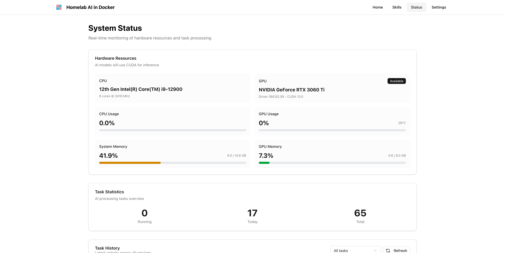

# Homelab AI in Docker

AI capabilities wrapped in API, specially crafted for homelab.

## Features

- RESTful API in Docker
- Curated models spanning low-end to high-end hardware
- Smart pooling and queue to manage GPU contention
- Python and AI wrapped, choose your app tech stack freely
- Built-in observability
- Developer friendly and LLM friendly
- **Remote MCP Server**: Exposes all AI capabilities via Model Context Protocol (MCP) for use with Claude Code and other MCP clients

## Screenshots

<table>
  <tr>
    <td width="33%"></td>
    <td width="33%"></td>
    <td width="33%"></td>
  </tr>
  <tr>
    <td width="33%"></td>
    <td width="33%"></td>
    <td width="33%"></td>
  </tr>
  <tr>
    <td width="33%"></td>
    <td width="33%"></td>
    <td width="33%"></td>
  </tr>
</table>

## Installation

```yaml
services:
  api:
    image: ghcr.io/xiaoyuanzhu-com/homelab-ai-in-docker:latest
    restart: unless-stopped
    ports:
      - "12310:12310"
    volumes:
      - ./data:/haid/data
    deploy:
      resources:
        reservations:
          devices:
            - driver: nvidia
              count: all
              capabilities: [gpu]
```

## Supported Tasks

| | |
|------|--------|
| Text Generation (LLM) | ✅ |
| Feature Extraction (Text Embedding) | ✅ |
| Image Captioning | ✅ |
| Image OCR | ✅ |
| Automatic Speech Recognition | ✅ |
| Web Crawling | ✅ |
| Doc to Markdown (MarkItDown) | ✅ |
| Doc to Screenshot (ScreenItShot) | ✅ |
| Remote MCP Server | ✅ |
| Speaker Embedding | Not yet |
| Text Classification | Not yet |
| Token Classification | Not yet |
| Question Answering | Not yet |
| Zero Shot Classification | Not yet |
| Translation | Not yet |
| Summarization | Not yet |
| Fill Mask | Not yet |
| Sentence Similarity | Not yet |
| Image Classification | Not yet |
| Object Detection | Not yet |
| Image Segmentation | Not yet |
| Text to Image | Not yet |
| Image to Image | Not yet |
| Unconditional Image Generation | Not yet |
| Zero Shot Image Classification | Not yet |
| Audio Classification | Not yet |
| Text to Speech | Not yet |
| Video Classification | Not yet |
| Video Object Tracking | Not yet |
| Video to Text | Not yet |
| Document Question Answering | Not yet |
| Visual Question Answering | Not yet |
| Image Text to Text | Not yet |
| Table Question Answering | Not yet |
| Tabular Classification | Not yet |
| Tabular Regression | Not yet |
| Reinforcement Learning | Not yet |

## Quick Start

### Docker (Recommended for Production)

**Prerequisites for GPU Support:**
- NVIDIA GPU with CUDA support
- [NVIDIA Container Toolkit](https://docs.nvidia.com/datacenter/cloud-native/container-toolkit/install-guide.html) installed
- Docker with GPU support enabled

**Option 1: Use pre-built image from GitHub Container Registry**

```bash
# Pull and run the latest image
docker pull ghcr.io/xiaoyuanzhu-com/homelab-ai-in-docker:latest

# Run with docker-compose (includes GPU support)
docker-compose up -d

# Or run directly with GPU support
docker run -d \
  -p 8000:8000 \
  -v $(pwd)/data:/haid/data \
  --gpus all \
  --name homelab-ai \
  ghcr.io/xiaoyuanzhu-com/homelab-ai-in-docker:latest

# Note: Image is built with CUDA support
# For CPU-only, use local development setup instead
```

**Option 2: Build locally**

```bash
# Build and run with docker-compose (includes GPU support)
docker-compose up -d

# Or build manually
docker build -t homelab-ai .

# Run with GPU support (required)
docker run -d \
  -p 8000:8000 \
  -v $(pwd)/data:/haid/data \
  --gpus all \
  --name homelab-ai \
  homelab-ai
```

The API will be available at `http://localhost:8000`

> **Note:** The Docker image and docker-compose.yml are configured for NVIDIA GPU environments. The image includes CUDA 12.4 PyTorch and flash-attn pre-installed. For CPU-only usage, consider using local development setup instead.

## Install Scenarios (Linux)

These are streamlined install paths for common Linux setups.

### 1) Linux with NVIDIA + CUDA (Docker)

- Requirements:
  - Install NVIDIA drivers and the [NVIDIA Container Toolkit](https://docs.nvidia.com/datacenter/cloud-native/container-toolkit/install-guide.html).
  - Ensure `docker run --gpus all nvidia/cuda:12.4.1-base-ubuntu22.04 nvidia-smi` works.
- Run with GPU acceleration:
  - `docker run -d -p 8000:8000 -v $(pwd)/data:/haid/data --gpus all --name homelab-ai ghcr.io/xiaoyuanzhu-com/homelab-ai-in-docker:latest`
  - Or `docker-compose up -d` (compose includes GPU config by default).
- GPU acceleration:
  - The Docker image includes CUDA 12.4-enabled PyTorch and flash-attn pre-installed for optimal performance.
  - No runtime configuration needed - GPU acceleration is ready out of the box.

### 2) Linux without NVIDIA/CUDA (Docker)

- **Note:** The Docker image is built with CUDA 12.4 support and assumes GPU availability.
- For CPU-only environments, it's recommended to use local development setup (see option 3 below) to avoid downloading unnecessary CUDA libraries.
- If you still want to use the Docker image without GPU:
  - `docker run -d -p 8000:8000 -v $(pwd)/data:/haid/data --name homelab-ai ghcr.io/xiaoyuanzhu-com/homelab-ai-in-docker:latest`
  - The image will work but may have slower startup and larger size due to included CUDA dependencies.

### 3) Linux from Source with uv (No Docker)

- Setup:
  - `uv venv && source .venv/bin/activate`
  - `uv pip install -e .`
  - Optional (crawler): `crawl4ai-setup`
- Run:
  - `uv run python main.py` (or `python main.py` if activated)
- GPU optional:
  - For GPU support: `uv pip install --extra-index-url https://download.pytorch.org/whl/cu124 -e .[gpu]`
  - This installs CUDA 12.4 PyTorch and flash-attn (requires CUDA toolkit installed on your system)
  - Without GPU extra, the app runs in CPU-only mode using the base PyTorch from pyproject.toml.

Data & caches
- Models and history store under `./data` in Docker (mounted to `/haid/data`).
- For local runs, `HF_HOME` defaults to `{project_root}/data/models` automatically (see `main.py`).

### Local Development

### Installation

```bash
# Create virtual environment
uv venv
source .venv/bin/activate  # On Windows: .venv\Scripts\activate

# Install dependencies
uv pip install -e .

# Setup browser for crawling
crawl4ai-setup
```

### Running the Server

```bash
# With uv (no activation needed)
uv run python main.py

# Or activate and run
source .venv/bin/activate  # On Windows: .venv\Scripts\activate
python main.py
```

The API will be available at `http://localhost:8000`

- Interactive API docs: `http://localhost:8000/api/docs`
- Health check: `http://localhost:8000/api/health`
- API info: `http://localhost:8000/api`

### Example Usage

**Crawl a webpage:**

```bash
curl -X POST http://localhost:8000/api/crawl \
  -H "Content-Type: application/json" \
  -d '{
    "url": "https://example.com",
    "screenshot": false,
    "wait_for_js": true
  }'
```

**Response:**

```json
{
  "request_id": "uuid",
  "url": "https://example.com/",
  "title": "Example Domain",
  "markdown": "# Example Domain\nThis domain is for use...",
  "html": "<!DOCTYPE html>...",
  "screenshot_base64": null,
  "fetch_time_ms": 1580,
  "success": true
}
```

**Convert a document to Markdown:**

See full request/response in API Reference: docs/api-reference.md#doc-to-markdown

## API Endpoints

All endpoints are under the `/api` prefix:

- `GET /api` - API status and information
- `POST /api/crawl` - Crawl and extract content from a URL
- `POST /api/embed` - Generate text embeddings
- `POST /api/caption` - Generate image captions
- `GET /api/history/{service}` - Get request history for a service
- `GET /api/health` - Health check
- `GET /api/ready` - Readiness check
- `GET /api/docs` - Interactive API documentation (Swagger UI)
- `POST /api/doc-to-markdown` - Convert documents (PDF, DOCX, PPTX, etc.) to Markdown
- `POST /api/doc-to-screenshot` - Convert documents to retina-quality PNG screenshots
- **`/mcp`** - Model Context Protocol (MCP) server endpoint (Streamable HTTP)

### MCP (Model Context Protocol) Support

The service exposes all AI capabilities as **remote MCP tools** at the `/mcp` endpoint, allowing Claude Code and other MCP clients to access them programmatically.

**Available MCP Tools:**
- `crawl_web` - Scrape web pages with JavaScript rendering
- `embed_text` - Generate text embeddings for semantic search
- `generate_text` - Generate text using language models
- `caption_image` - Generate captions for images
- `ocr_image` - Extract text from images using OCR
- `transcribe_audio` - Transcribe speech from audio files
- `get_hardware_info` - Get GPU and system hardware information

**Client integrations:**
- **Claude Code**
  1. Start the service and verify it with `curl http://localhost:12310/api/health`.
  2. Add a remote MCP server in Claude Code that points to `http://localhost:12310/mcp`.
  3. Claude Code will auto-discover the tools above and expose them in the MCP sidebar.
- **Codex CLI / other MCP clients**
  1. Target the trailing-slash endpoint: `http://localhost:12310/mcp/`.
  2. Include the required headers when making requests manually:<br>
     `Accept: application/json, text/event-stream` and `Content-Type: application/json`.
  3. Example initialize call:
     ```bash
     curl http://localhost:12310/mcp/ \
       -H "Accept: application/json, text/event-stream" \
       -H "Content-Type: application/json" \
       -d '{"jsonrpc":"2.0","id":1,"method":"initialize","params":{"protocolVersion":"2024-11-05","capabilities":{},"clientInfo":{"name":"curl","version":"1.0"}}}'
     ```

## Directory Structure

```
/haid (or . in dev)
├── data/              # Model cache and history database (git-ignored)
│   ├── models/        # All models stored using HF_HOME convention
│   │   └── hub/       # HuggingFace cache: models--{org}--{model}/
│   └── history.db     # SQLite database for request history
├── src/               # Application source
└── main.py            # Application entry point
```

**Model Storage**: All AI models use HuggingFace's standard `HF_HOME` convention, automatically organizing models in `data/models/hub/` with a consistent structure. This enables centralized model management across all task types (embedding, caption, OCR, etc.) through a unified models manifest and API.

## Documentation

- [Product Design](docs/product-design.md) - User-focused overview
- [Technical Design](docs/tech-design.md) - Implementation details
- [API Reference](docs/api-reference.md) - Full endpoint reference and examples
- [Deployment Guide](docs/deployment.md) - Docker, GHCR, and production deployment
- [CLAUDE.md](CLAUDE.md) - AI assistant context

Architecture highlight: OCR inference runs in isolated worker processes with a short‑lived cache (5s linger) to balance batch throughput and fast GPU memory release. See Technical Design for details.

## Development

```bash
# Install in development mode
uv pip install -e ".[dev]"

# Run with auto-reload (using uv)
uv run uvicorn main:app --reload

# Or activate first
source .venv/bin/activate
uvicorn main:app --reload
```

### WhisperX + CUDA Troubleshooting

If you see errors like:

- `Unable to load any of {libcudnn_cnn.so.9.1.0, libcudnn_cnn.so.9.1, libcudnn_cnn.so.9, libcudnn_cnn.so}`
- `Invalid handle. Cannot load symbol cudnnCreateConvolutionDescriptor`

You’re hitting a CUDA shared library discovery issue (common on Python 3.13). This repo includes a robust fix:

- Runtime fix in-app: CUDA library paths are initialized before importing Torch.
- Docker fix: `LD_LIBRARY_PATH` includes the pip-installed NVIDIA libraries.
- Dependency fix: cuDNN/cuBLAS/CUDA runtime pinned to match `torch==2.8.0+cu126`.

Local venv usage (outside Docker):

```bash
# Activate your venv, then source the helper to expose NVIDIA libs
source scripts/setup_cuda_env.sh

# Now run your tests or the server
python -c "import torch; print(torch.backends.cudnn.is_available())"
python main.py
```

If you still see cuDNN errors, verify the HuggingFace token is set for diarization:

```bash
export HUGGING_FACE_HUB_TOKEN=hf_...
```

## License

MIT
